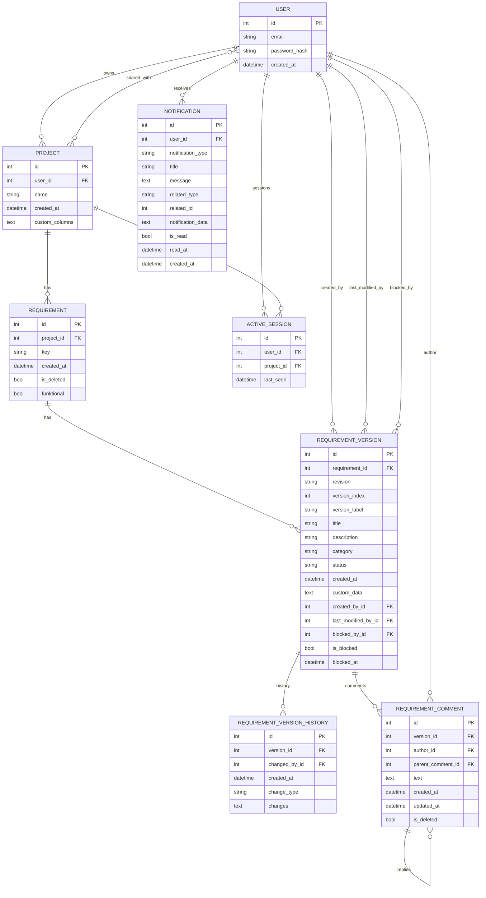

## VS Code: .env-Variablen im Terminal nutzen

Um Umgebungsvariablen aus der Datei `.env` auch im VS Code-Terminal zu verwenden, aktiviere die Einstellung:

```
"python.terminal.useEnvFile": true
```

Diese Option findest du in den VS Code Einstellungen (`settings.json`).

# Interface für MBSE-Modelle (Requirements Management Tool)

Eine moderne Flask-basierte Webanwendung für das Management von Software-Anforderungen mit KI-Unterstützung.

## 📋 Überblick

Diese Anwendung ermöglicht es Benutzern, Software-Anforderungen zu erstellen, zu verwalten und zu versionieren. Sie integriert KI-Funktionen zur automatischen Generierung von Anforderungen und bietet eine benutzerfreundliche Weboberfläche für das Requirements Engineering.

## 🚀 Hauptfunktionen

### 🔐 Benutzerverwaltung

- Benutzerregistrierung und -anmeldung
- Sichere Passwort-Hashing
- Flask-Login Integration

### 📁 Projektmanagement

- Erstellung und Verwaltung mehrerer Projekte
- Projekt-Sharing mit anderen Benutzern
- Individuelle Spaltenkonfiguration pro Projekt

### 📝 Anforderungsmanagement

- Erstellung von Anforderungen mit Titel, Beschreibung und Kategorie
- Versionsverwaltung (A, B, C, ...)
- Status-Tracking (Offen, In Arbeit, Fertig)
- Soft-Delete Funktionalität mit Papierkorb

### 🤖 KI-Integration

- OpenAI GPT-Integration für automatische Anforderungsgenerierung
- Konfigurierbare KI-Modelle und Prompts
- Dynamische Spaltenunterstützung für KI-generierte Inhalte

### 📊 Datenverwaltung

- SQLite Datenbank mit SQLAlchemy ORM
- Migration-Unterstützung
- Excel Import/Export Funktionalität
- JSON-basierte dynamische Spalten

### 🎨 Benutzeroberfläche

- Bootstrap 5 basierte responsive Weboberfläche
- Deutsche Lokalisierung
- Intuitive Navigation und Benutzerführung
- Flash-Nachrichten für Benutzerfeedback

## 🏗️ Technische Architektur

### Backend

- **Flask**: Web-Framework
- **SQLAlchemy**: ORM für Datenbankoperationen
- **Flask-Login**: Benutzersitzungsverwaltung
- **OpenAI API**: KI-Integration

### Frontend

- **Bootstrap 5**: CSS Framework
- **Bootstrap Icons**: Icon-Sammlung
- **Jinja2**: Template-Engine
- **JavaScript**: Interaktive Funktionen

### Datenbankmodell

- **User**: Benutzerkonten
- **Project**: Projekte mit dynamischen Spalten
- **Requirement**: Anforderungen mit Soft-Delete
- **RequirementVersion**: Versionierte Anforderungsdaten

ER-Diagramm (aus den SQLAlchemy-Models abgeleitet):



## 📦 Installation

### Voraussetzungen

- Python 3.8+
- pip
- OpenAI API Key

### Setup

1. Repository klonen:

```bash
git clone <repository-url>
cd interface_for_mbse_models
```

2. Virtuelle Umgebung erstellen und aktivieren:

```bash
python -m venv .venv
.venv\Scripts\activate  # Windows
# oder
source .venv/bin/activate  # Linux/Mac
```

3. Abhängigkeiten installieren:

```bash
pip install -r requirements.txt
```

4. Umgebungsvariablen konfigurieren:

```bash
# .env Datei erstellen
OPENAI_API_KEY=your_openai_api_key_here
OPENAI_MODEL=gpt-4o-mini  # Optional
```

5. Anwendung starten:

```bash
python main.py
```

Die Anwendung ist dann unter `http://127.0.0.1:5000` verfügbar.

## 🔧 Konfiguration

### Umgebungsvariablen

- `OPENAI_API_KEY`: Erforderlich für KI-Funktionen
- `OPENAI_MODEL`: KI-Modell (Standard: gpt-4o-mini)
- `SYSTEM_PROMPT_PATH`: Pfad zu benutzerdefiniertem System-Prompt
- `SYSTEM_PROMPT`: Inline System-Prompt

### Datenbank

Die Anwendung verwendet SQLite und erstellt automatisch alle Tabellen beim ersten Start. Die Datenbankdatei befindet sich in `instance/db.db`.

## 📖 Verwendung

### Erste Schritte

1. **Registrierung**: Neuen Account erstellen
2. **Projekt erstellen**: Neues Projekt anlegen
3. **Anforderungen generieren**: KI-gestützte Anforderungserstellung
4. **Anforderungen verwalten**: Versionen bearbeiten und Status aktualisieren

### Projekt-Sharing

- Projekte können mit anderen registrierten Benutzern geteilt werden
- Shared User haben Lese-/Schreibzugriff auf geteilte Projekte

### Anforderungslebenszyklus

1. **Erstellung**: Neue Anforderung mit KI-Unterstützung
2. **Bearbeitung**: Versionierung und Status-Updates
3. **Archivierung**: Soft-Delete in Papierkorb
4. **Wiederherstellung**: Aus Papierkorb zurückholen
5. **Endgültige Löschung**: Permanente Entfernung

## 🧪 Tests

### Verfügbare Tests

- `test_quick.py`: Schnelle API-Konnektivitätstests
- `test_integration.py`: Integrations- und Funktionstests
- `test_ai_agent.py`: KI-Agent Tests
- `test_template_rendering.py`: Template-Rendering Tests

### Tests ausführen

```bash
python test_quick.py
python test_integration.py
```

## 📁 Projektstruktur

```
interface_for_mbse_models/
├── app/
│   ├── __init__.py          # Flask-App Factory
│   ├── models.py            # Datenbankmodelle
│   ├── routes.py            # Haupt-Routen
│   ├── auth.py              # Authentifizierung
│   ├── agent.py             # KI-Agent Funktionen
│   ├── migration.py         # Datenbankmigrationen
│   ├── services/
│   │   └── ai_client.py     # OpenAI Integration
│   ├── static/              # Statische Dateien
│   │   ├── style.css
│   │   ├── project.js
│   │   └── bootstrap-icons.css
│   └── templates/           # Jinja2 Templates
│       ├── base.html
│       ├── start.html
│       ├── create.html
│       └── ...
├── config.py                # Konfiguration
├── main.py                  # Anwendungsstart
├── requirements.txt         # Python-Abhängigkeiten
├── test_*.py               # Tests
└── instance/               # Datenbank (wird erstellt)
```

## 🔒 Sicherheit

- Passwort-Hashing mit Werkzeug
- CSRF-Schutz durch Flask-WTF
- SQL-Injection-Schutz durch SQLAlchemy
- XSS-Schutz durch Jinja2 Auto-Escaping
- Sichere Session-Verwaltung

## 🤝 Beitragen

1. Fork des Projekts
2. Feature-Branch erstellen (`git checkout -b feature/AmazingFeature`)
3. Änderungen committen (`git commit -m 'Add some AmazingFeature'`)
4. Branch pushen (`git push origin feature/AmazingFeature`)
5. Pull Request erstellen

## 📝 Lizenz

Dieses Projekt ist unter der MIT-Lizenz lizenziert - siehe die [LICENSE](LICENSE) Datei für Details.

## 📞 Support

Bei Fragen oder Problemen:

- GitHub Issues erstellen
- Dokumentation konsultieren
- Code-Kommentare prüfen

## 🔄 Migration und Updates

Die Anwendung unterstützt Datenbankmigrationen für Schema-Updates. Bei größeren Änderungen werden Migrationsskripte im `migrate_*.py` Format bereitgestellt.

## 🌟 Besondere Features

- **Dynamische Spalten**: Projekte können individuelle Spalten definieren
- **KI-gestützte Generierung**: Automatische Anforderungserstellung
- **Versionskontrolle**: Vollständige Historie aller Änderungen
- **Projekt-Sharing**: Kollaborative Arbeit an Projekten
- **Excel Integration**: Import/Export von Anforderungen
- **Responsive Design**: Funktioniert auf Desktop und Mobile

---

Entwickelt mit ❤️ für effektives Requirements Engineering.
